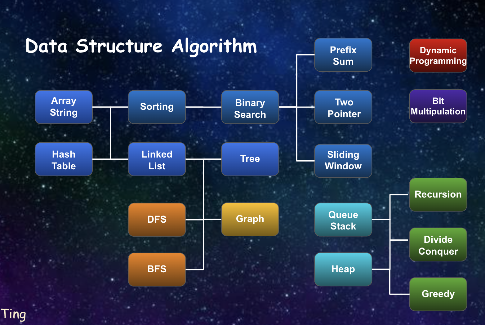

# DSA Cookbook

Welcome to the DSA Cookbook, a collection of Data Structures and Algorithms topics organized for learning and reference. This repository aims to provide explanations, code examples, and resources related to various data structures and algorithmic concepts.

## Table of Contents

- [Data Structure](#data-structure)
- [Algorithm](#algorithm)
- [Introduction](#introduction)
- [Usage](#usage)
- [Contributing](#contributing)
- [License](#license)

## Data Structure

Learn about various data structures that help in organizing and manipulating data effectively.

- Arrays & Strings
- Hash Tables
- Linked Lists
- Trees
- Graphs
- Queues & Stacks
- Heaps

## Algorithm

Explore different algorithmic techniques and strategies for problem-solving.

- Sorting Algorithms
- Binary Search
- Prefix Sum
- Two Pointer Approach
- Sliding Windows
- Depth-First Search
- Breadth-First Search
- Recursive Techniques
- Divide & Conquer
- Greedy Algorithms
- Dynamic Programming
- Bit Manipulation

## Introduction

The DSA Cookbook is a resource designed to assist programmers in understanding the fundamental concepts of data structures and algorithms. It is organized to help both beginners and experienced developers improve their problem-solving skills and algorithmic thinking.

## Usage

This repository contains explanations, code examples, and resources related to each data structure and algorithm topic. The main content is organized into the "Algorithm" and "Data Structure" folders. Markdown files provide explanations, and code snippets demonstrate the implementation.

To view images and diagrams associated with the content, refer to the "image" folder.

## License

This project is licensed under the [MIT License](LICENSE).
